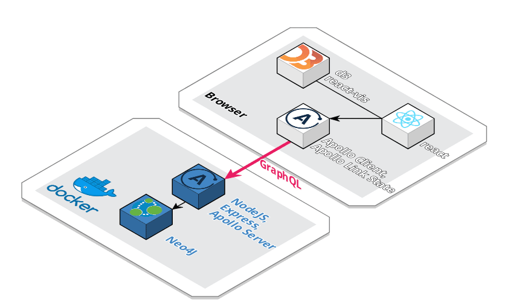

# Costruire una dashboard con GraphQL e React

* [Link slide del talk](https://docs.google.com/presentation/d/1hY6oVJSPujvnBYfFrGeRi_MyafQjkbiobfK23ASHtXw/edit?usp=sharing)
* [Video talk](https://youtu.be/U41lUJCs5H4?t=1768)

Questo repository contiene il codice mostrato durante il talk del 21/11/2018 al meetup RomaJS per la parte client.

Ad ogni modo è stata inclusa una configurazione Docker (mediante `docker-compose`) con tutto il necessario per far girare la dashboard in locale.

Per informazioni riguardo la prima parte del talk (cioè come ottimizzare GraphQL lato server) fare riferimento a questo repository: https://github.com/GraphRM/graphql-graphdb

## Overview architettura

Questo è uno schema basilare dell'architettura e delle tecnologie usate:



### Requisiti

* NodeJS > 8
* Docker con `docker-compose`

## Setup

Il repository contiene già uno snapshot dei dati per il database, mentre il server GraphQL è stato creato mediante `Apollo Server`.

Per avviare i container Docker andare sulla cartella principale del progetto ed eseguire:

```sh
docker-compose up -d
```

Al termine dell'installazione:
* il database Neo4J sarà disponibile su `localhost:7474` - può richiedere qualche minuto per il primo avvio
* il server GraphQL sarà disponibile su `localhost:4000` - in questo caso una versione Apollo dell'editor GraphiQL sarà disponibile, dove sarà mostrato anche lo schema.

Il codice del server GraphQL è disponibile nella cartella `server` di questo repository.
I dati del database sono stati pre-caricati tramite la cartella `data` in questo repository.

## Server -> Database

Un file `.env` è stato incluso in questo repository all'interno della cartella `server` di proposito, in modo da mostrare come è stato configurato il database.
La connessione tra il server GraphQL ed il database Neo4J avviene mediante l'adapter ufficiale Neo4J.
Per maggiori informazioni consultare anche il file `docker-compose.yml`.

## Dashboard

La dashboard in questo repository è stata creata con il seguente comando:

```
npx create-react-app dashboard
cd dashboard
npm install apollo-boost react-apollo graphql graphql-tag
npm start
```

## Next steps

I diversi branch in questo repository sono stati numerati per mostrare passo dopo passo come è stato costruito il progetto.

### master branch

In questo branch si è creato il progetto base con `create-react-app`.

### 01-apollo branch

In questo branch si è aggiunto al progetto Apollo Client con un componente Query per recuperare i dati dal server e mostrarli testualmente.

[Clicca qui per vedere le differenze rispetto a `master`.](https://github.com/dej611/graphql-dashboard-talk/compare/master...01-apollo)

### 02-add-chart branch

In questo branch si è aggiunta una nuova dipendenza `react-vis` e aggiunto il contenuto del componente `Chart.js`.
Il codice del grafico è ispirato a questa demo: http://vallandingham.me/bubble_charts_with_d3v4.html

Se doveste avere un errore sul browser, aggiungete la dipendenza dalla console:

```
npm install react-vis
```

[Clicca qui per vedere le differenze rispetto a `01-apollo`.](https://github.com/dej611/graphql-dashboard-talk/compare/01-apollo...02-add-chart)

### 03-add-another-chart branch

In questo branch viene aggiunto un nuovo grafico, con relativa Query GraphQL.

[Clicca qui per vedere le differenze rispetto a `02-add-chart`.](https://github.com/dej611/graphql-dashboard-talk/compare/02-add-chart...03-add-another-chart)

### 04-use-apollo-for-client-state branch

In questo branch viene aggiunto uno state manager all'app sfruttando le funzionalità di Apollo Link State.
Oltre allo schema e ai resolver lato client, vengono arricchite le Query GraphQL con parametri client (vedere la notazione `@client`).


[Clicca qui per vedere le differenze rispetto a `03-add-another-chart`.](https://github.com/dej611/graphql-dashboard-talk/compare/03-add-another-chart...04-use-apollo-for-client-state)